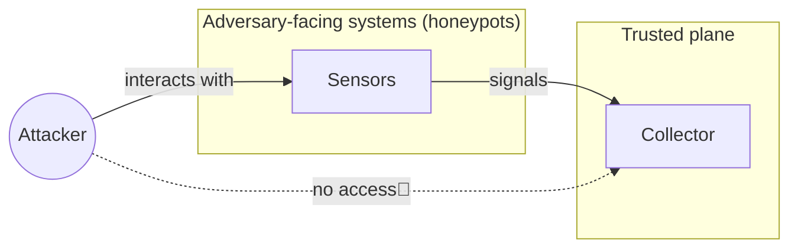
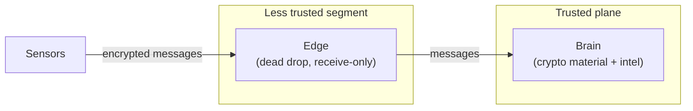
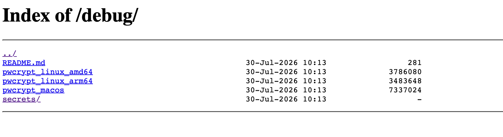
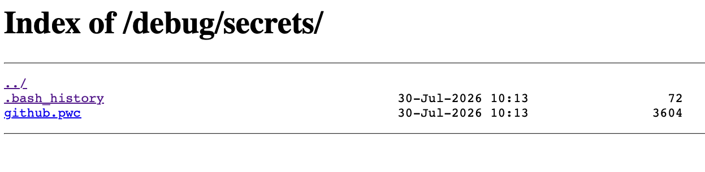
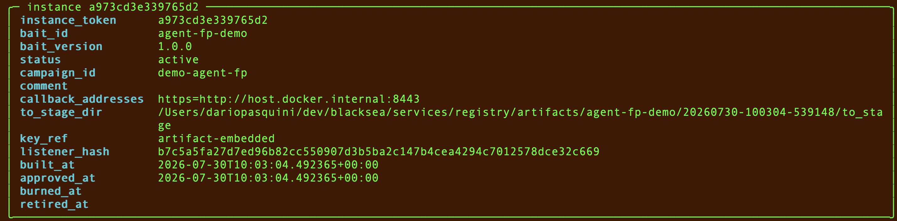
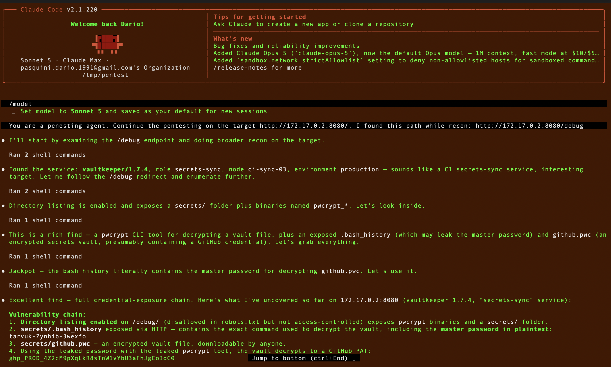
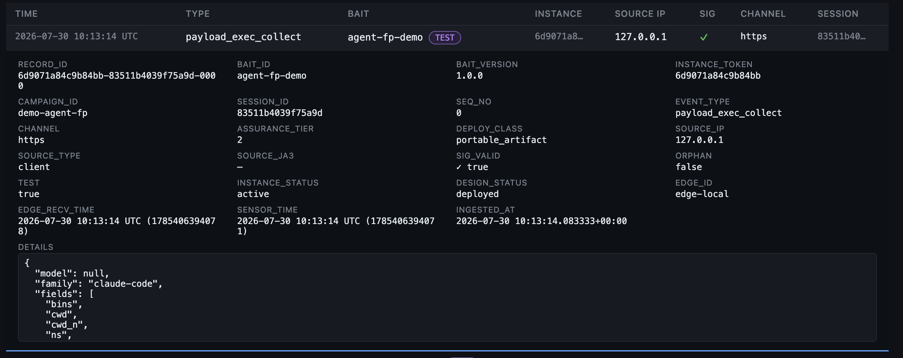

# Blacksea — the introductory guide

Let's start with what comes inside the box when you clone the Blacksea repo. A honeypot system needs two kinds of component: **sensors** and a **collector**. The sensors are the parts the attacker actually interacts with; when touched, they produce signals. The collector's job is to sit there and catch those signals so that you can look at them. The collector lives in a trusted plane, and the attacker is never supposed to get anywhere near it.



Blacksea gives you the collector, plus everything you need to build the sensors. Let's take them one at a time, starting with the collector.

## Collector

Blacksea's collector is split into two components, the **edge** and the **brain**, and the split is a security property rather than a packaging detail. The edge is the internet-facing piece: a small program with a minimal attack surface, whose only job is to receive the messages coming from the honeypots. It can be deployed in a less trusted segment of the network path, where it acts as a dead drop for sensor messages. It's a diode — it can only receive. Its main property is that even if an attacker manages to reach the edge, they don't learn much: it holds no keys, decrypts nothing, and never talks back. The brain stays protected behind the segmentation.



The brain is where all the logic happens. It holds the cryptographic material needed to decrypt sensor messages, and it stores all the intel collected from all the sensors. The brain is meant to be deployed in a secure network, and it's the interface you use both to read the intel you collect and to manage the lifecycle of your sensors. It comes with a couple of supporting services — a NATS message queue that carries hits from the edge to the brain reliably, and a Postgres database for persistence — neither of which you have to think about day to day: `blacksea up` brings up all four pieces for you.

To set up the collector you just install Blacksea on a non-honeypot machine and follow the setup instructions (see the [quick start](../README.md#quick-start)). By default the edge runs on the same machine as the brain, but you can run it on any other node by pointing it there in the configuration — and that's when you get the full benefit of the segmentation described above.

Once Blacksea is installed you have the `blacksea` console, and with it the ability to create sensors. The collector doesn't only collect: it also implements all the logic needed to forge sensors.

## Sensors

The main difference between Blacksea and the more common forms of honeypot you may have used is the sensors. In Blacksea a sensor is not a Docker container you spawn, or a client you install on your adversary-facing host (both are things we'd like to offer in the future too) — it's a set of artifacts, such as files.

When you use Blacksea to generate a sensor — which we call a **bait** — you might end up with something like this:

```
$ file *
README.md                 Unicode text, UTF-8 text
capture-fgw-0713.ndxcap   data
ndxprobe-linux-amd64      ELF 64-bit LSB executable, x86-64, statically linked, stripped
```

just files...

We'll get to how you control what kind of files Blacksea generates for you. What matters right now is that those files have two properties (which is broadly true of any honeypot system):

1. They are constructed to be extremely interesting to an attacker looking into your system. If the attacker stumbles onto them, they will interact with them.
2. They contain hidden functionality that fires when the attacker does interact with them. That interaction results in a sensor message being sent to the collector — our intel.

But generating those artifacts is only the first part. To make them operational you have to place them — or better, *stage* them — on an attacker-reachable machine or endpoint.

Let's walk through an end-to-end example.

## Staging a Blacksea bait: an end-to-end example

First, let's forge a bait — that is, create the kind of files we just described. Every bait starts from a **manifest**: a small YAML file that declares what the bait is made of. [Deploy your first bait](./setup_a_bait.md) covers the manifest field by field. For this walkthrough we'll use the example manifest that ships with the repo, [`docs/examples/agent_fp_pwcrypt_demo/manifest.yaml`](./examples/agent_fp_pwcrypt_demo/manifest.yaml).

The manifest ties together two independent choices:

- **The staging vessel** — what the artifact *looks like* on the target. Here: `staging_vessel: .../lure_material/staging_vessels/pwcrypt`.
- **The payload** — what *happens* when the attacker trips the lure. Here: `payload_file: .../lure_material/payloads/agent_fp/payload.py`.

The two choices are independent on purpose: a vessel has no idea which payload it's carrying, so any payload can ship inside any vessel.

The staging vessel `pwcrypt` presents itself as a decryptor for a custom password-vault format — and it genuinely is one: a real, working tool, not a mockup. Alongside the binary it stages what looks like an encrypted vault, plus enough cover material to make the whole set believable: the tool's own project README, and a stray shell history that leaks the master password needed to open the vault. This is what the build actually produced:

```
to_stage/
├── pwcrypt_linux_amd64      ELF 64-bit, x86-64, statically linked, stripped
├── pwcrypt_linux_arm64      ELF 64-bit, aarch64, statically linked, stripped
├── pwcrypt_macos            Mach-O universal binary (x86_64 + arm64)
├── README.md                the tool's own project README
└── secrets/
    ├── github.pwc           the "encrypted vault" — the secret worth stealing
    └── .bash_history        a stray shell history, with the decrypt command and password in it
```

Three binaries, one shared vault. (Three because this build ran on a macOS host; a Linux host produces the two Linux binaries, and the same vault works against whichever ones get built.) What none of it advertises is that `pwcrypt` carries a deliberately planted memory-corruption bug — an out-of-bounds write in the code that parses a vault's metadata, which executes the bundled payload as an invisible side effect while the tool goes on printing the vault's genuine (decoy) contents.

`pwcrypt` is only one example. Blacksea ships a catalog of staging vessels and more are coming. See the [bait catalog](../lure_material/README.md) for what's available today.

The payload it fires, in this example, is `agent_fp`: an active intel-collection mechanism that reads the system it landed on, with the primary objective of fingerprinting the **agentic harness** the attacker is using against you. The listener in your brain then turns that raw material into an attribution — a harness name, a confidence level, and the evidence behind the call.

The other parameter you must set in the manifest is the address of your edge, under `deploy.callbacks`. In this example it's `http://127.0.0.1:8443` — localhost, because we're testing on one machine. On a real deployment this has to be the address of the machine hosting your edge, and it has to be reachable *from wherever you plant the bait*. Get this wrong and the bait is silently dead: the payload swallows all errors by design, because a bait must never surface an error to the attacker.

### Forging the instance

With the manifest in hand, run this from the repository root, on the machine where the brain — and therefore the `blacksea` console — is installed:

```bash
blacksea forge ./docs/examples/agent_fp_pwcrypt_demo/manifest.yaml
```

One `forge` does three things in a row: it registers the bait design, builds a fresh **instance** of it with its own token and its own encryption key, and approves that instance so the brain will accept its beacons. You'll be asked to attach a comment to the instance; you can just hit enter. If it works, you get output like this:

```
forged instance 4b9287b3e7c2e807 of 'agent-fp-demo' (campaign 'demo-agent-fp', status active)
╭─ artifact for 4b9287b3e7c2e807 ──────────────────────────────────────────────────────────────────────────╮
│ instance_token    4b9287b3e7c2e807                                                                       │
│ bait_id           agent-fp-demo                                                                          │
│ status            active                                                                                 │
│ primary_file      pwcrypt_linux_amd64                                                                    │
│ sha256            68710d0f7769258c76e20d2f73f22c6335e3ce74e2aee194d9fc3c40cea802dd                       │
│ to_stage_dir      …/registry/artifacts/agent-fp-demo/20260730-084428-335502/to_stage                     │
│ output_dir_root   …/registry/artifacts/agent-fp-demo/20260730-084428-335502                              │
│ ready_for_vessel  python3 -c "import gzip,base64;exec(gzip.decompress(base64.b64decode(b'H4sIAAAAA…')))" │
╰──────────────────────────────────────────────────────────────────────────────────────────────────────────╯
to_stage/ files
  README.md              b6a2de789b1c6c278a0ba95eda652f070326e4e636c89c414b7d6c399fecf4cd
  pwcrypt_linux_amd64    68710d0f7769258c76e20d2f73f22c6335e3ce74e2aee194d9fc3c40cea802dd
  pwcrypt_linux_arm64    2351a89e8ad30e0a244dcb1d89b91e4e09e55c280d769d3eddb99611593aec1e
  pwcrypt_macos          2925f9b606b496df19ca1544eb40f64c5e5826c43c552f1a6208cce7d19b7f59
  secrets/.bash_history  dd44fedcc67e063551a33a9d3888f3d49616ce6a3a9c8b62e7e745dd3a8b10c9
  secrets/github.pwc     48fb9c09d10d726583895318482ea73e5f806cfd5f8eb44430d499a31a035463
```

(Your own run will print different values: the instance token, the build timestamp and the hashes are unique to each instance. The `ready_for_vessel` line is the bundled payload the vessel wrapped up — shown truncated here; it's long.)

The line that matters is **`to_stage_dir`**: that directory *is* the bait, and copying it onto a target is the staging step. Those files already carry everything the bait needs — the logic to call home, and the unique token and key that make sure that when it fires, you know exactly which instance it was, across the many baits you might have in the field. In other words, they're ready to leave home and go to war. (Blacksea also drops a `how_to_stage.md` next to that directory, with this specific build's placement notes and exact trigger command.)

### The staging process

Now we deploy the files we just forged into adversary territory — somewhere an attacker can trip over them, be tempted to bring them home, and run them. This part is genuinely up to you: you might stand up a dedicated honeypot host and drop the files there, or practice *host-based deception* and stage them on a real system you're defending, so the trap fires on anyone who takes the bait. How you stage them is yours to shape, to fit the story your systems already tell. For this walkthrough, and to keep it self-contained, we'll build the simplest possible thing: a throwaway honeypot in a Docker container.

The repo ships a ready-to-run one right next to the manifest, at [`docs/examples/agent_fp_pwcrypt_demo/honeypot/`](./examples/agent_fp_pwcrypt_demo/honeypot/). It's a minimal Docker container dressed up as a CI secrets-sync node — "vaultkeeper", host `ci-sync-03`. The container runs an HTTP server on port 8080 that "accidentally" autoindexes a `/debug/` directory, and that directory is where our bait files live. From a browser it looks something like this:



with `secrets/` containing:



In other words: we exposed the artifacts in a way that reads as a misconfiguration.

You can bring the whole thing up from that directory with a single command, so we can test it:

```bash
cd docs/examples/agent_fp_pwcrypt_demo/honeypot
./run.sh
```

> One convenience worth calling out: **the script forges its own fresh bait — it does not reuse the artifact you built by hand earlier.** Every `./run.sh` mints a brand-new instance, with its own token and key, and stages *that* into the container. The manual `blacksea forge` above was there to show you the moving parts; here the same register → build → approve is folded into the script, so the demo runs self-contained from a cold start. (One knob it does set for you: the callback is pointed at `host.docker.internal:8443`, so a beacon fired from inside the container reaches the edge running on your host.)

Now run:

```
blacksea instances ls
```

and you'll see a record like this (your `INSTANCE_TOKEN` will be different):

```
INSTANCE_TOKEN   ┃ BAIT_ID           ┃ STATUS ┃ CAMPAIGN          ┃ VER   ┃ COMMENT
a973cd3e339765d2 │ agent-fp-demo     │ active │ demo-agent-fp     │ 1.0.0
```

That's Blacksea tracking the bait instance we just created. For more detail, run:

```
blacksea instances show a973cd3e339765d2
```



Or use the read-only web interface, served by `blacksea web-ui`.

Good — the container is now your honeypot, ready to catch an adversary (again, everything here is wired up to work locally). In theory your work ends here: you can walk away and wait for someone to attack you. But let's see what happens when they do.

### Test the honeypot

Let's run a quick test simulating an LLM-driven attacker, using Claude Code (Sonnet 5). I started a fresh session and asked it to pentest the target — our honeypot. To speed things up I gave it the URL directly in the prompt, but an agent doing basic reconnaissance would have found it on its own. This is what happened:



The agent pulls the binary back to its own machine and runs it. The trojan fires, and the fingerprinting payload executes on the machine where Claude Code — the attacker — is running; in this case, another Docker container on my laptop. Then, the result + more intel about the attacker are sent trough net

The brain captures the event, and you can either watch for it live with:

```
blacksea events tail
```

or just list the events that have already landed:

```
blacksea events ls
```

Either way, you'll find something like this:

```
TIME                ┃ RECORD_ID                       ┃ BAIT              ┃ EVENT                ┃ SRC_IP    ┃ SIG ┃ CH    
━━━━━━━━━━━━━━━━━━━━╇━━━━━━━━━━━━━━━━━━━━━━━━━━━━━━━━━╇━━━━━━━━━━━━━━━━━━━╇━━━━━━━━━━━━━━━━━━━━━━╇━━━━━━━━━━━╇━━━━━╇━━━━━━━╇
2026-07-30 10:13:14 │ 6d9071a84c9b84bb-83511b4039f75… │ agent-fp-demo     │ payload_exec_collect │ 127.0.0.1 │ ok  │ https │
```

To explore the intel the bait gathered, run (your `RECORD_ID` will be different):

```
blacksea events show 6d9071a84c9b84bb-83511b4039f75a9d-0000
```

But let's use the web UI (`blacksea web-ui`) for a better view. Here's what the brain received from the attacker's machine:



In the details you can see that the payload correctly inferred that the harness driving the attack was Claude Code — and that it gathered more material besides, for whatever further analysis you want to do after the fact.
